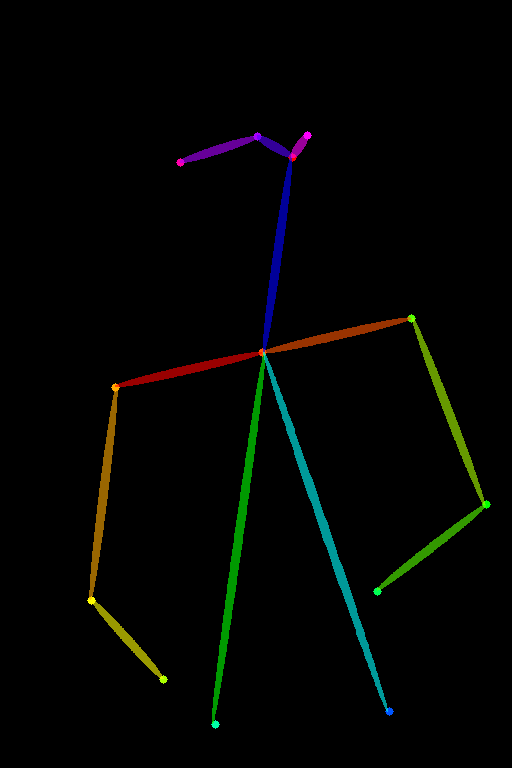

The project is based on [FastComposer: Tuning-Free Multi-Subject Image Generation with Localized Attention](https://github.com/mit-han-lab/fastcomposer), training dataset use MGC dataset, prompt use the prompt generated from the MGC dataset detected by BLIP2 model.

## Environment Setup
```
conda create -n fastcomposer python
conda activate fastcomposer
pip install torch torchvision torchaudio
pip install transformers==4.25.1 accelerate datasets evaluate diffusers==0.16.1 xformers triton scipy clip gradio facenet-pytorch

python setup.py install
```
You can also refer to the file 'fastcomposer_requirements.txt', which is the version of the package we can run in our environment.

## Preparing Database
1. Prepare a folder "MGC" in any path for storing data, the data storage format is as follows:
```
| MGC/
|---- 00000/ (use this folder in training process)
|-------- 10000_blip2_captions.json
|-------- 10000.jpg
|-------- 10000.npy
|---- mask_/
|-------- 10000/
|------------ 10000_seg_mask/
|---------------- 10000.png
|------------ 10000_sub_seg/
|---------------- 10000.png
|---- image_ids_train.txt (use this file in training process)
        '10000'
        '10002'
        '10003'
```
2. Run "MGC data preprocess" in file_process_.ipynb

## Revise
1. Revise scripts/run_training.sh
```
--config_file /dfs/comicai/chenyu.liu/cache/huggingface/accelerate/default_config.yaml \
--logging_dir logs_blip2_captions/${MODEL}/${DATASET_NAME}/${WANDB_NAME} \
--output_dir models_blip2_captions/${MODEL}/${DATASET_NAME}/${WANDB_NAME} \
--train_batch_size 12 \
--keep_interval 10000 \
```
2. Revise fastcomposer/data.py
Change the "##" in two places ".json" to "_blip2_captions.json"
3. Revise default_config.yaml
Comment out "debug: false"

## Train
```
export PYTHONPATH=$(pwd):$PYTHONPATH
bash scripts/run_training.sh
```

## Test
Revise "scripts/run_inference_batch.sh"
```
bash scripts/run_inference_batch.sh
```

## Show
Run "Test for "DEMO_NAME CKPT CAPTION" in fastcomposer/show_ckpt_img_.ipynb

## + ControlNet
1. Revise utils.py: 

    a. Add parameter--pose_image_path in "##"

2. Revise inference_controlnet.py: 

    a. Copy inference.py to inference_controlnet.py

    b. Add as follows:
    ```
      image = load_image(
          # '/nas40/chenyu.liu/Tests_/pose.png'
          args.pose_image_path
      )
    ```
3. Revise "run_inference_batch_controlnet.sh":

    a. Copy "run_inference_batch.sh" to "run_inference_batch_controlnet.sh"

    b. Add the parameters associated with "POSES"

    c. Revise "fastcomposer/inference_controlnet.py \\"
```
bash run_inference_batch_controlnet.sh
```

## Show
Run "Test for "DEMO_NAME CKPT CAPTION POSE" in fastcomposer/show_ckpt_img_.ipynb

## CKPT
Before this, we also followed the above process to train the 336k danbooru dataset, and finally got a good ckpt, you can download it [here](https://www.alipan.com/s/dtxdo84in49), note that revise "num_hidden_layers" to "11" in loaded model anythingv3 path "Linaqruf_anything-v3.0/text_encoder/config.json"

Its result display is as below:

Number of train images: 336k

Number of time of the train images: 52.36

prompt: "a GENDER <|image|> is reading book"
| input_image | GENDER | output_images (ckpt: 220k) | output_images (ckpt: 115k)  | 
| ------- | ------- | ------- |  ------- | 
|       | girl |    |     | 
|    | girl |    |    |
|             | girl |    |       |
